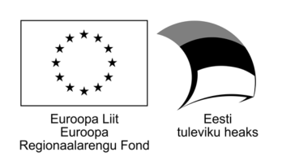

# BIOGEOMON 2022 Python Pangeo Workshop by Landscape Geoinformatics

Spatio-temporal trend analysis of spatial climate data (temperature and rainfall) using Python

[BIOGEOMON Pre-conference Workshop](https://biogeomon2022.ut.ee/pre-conference-workshop)

There are wide range of global or regional level climate data available in a gridded format. Under the changing climate, we need to quantify the variability of temperature and rainfall patterns to understand the impact of climate change on ecosystems. In this workshop, we teach the participants how to handle NetCDF datasets, apply the Mann-Kendall (MK) test and calculate Sen's slope (SS) values on a gridded climate dataset.

We will be using Python packages from the [Pangeo](https://pangeo.io/about.html) community, including [Jupyter](http://jupyter.org/) notebooks and the [Xarray](https://xarray.pydata.org/en/latest/) toolkit for working with labeled multi-dimensional arrays of data. In addition, we will demonstrate a few basic steps how to improve reproducibility and pro-actively apply FAIR principles when sharing and archiving data and code online for publishing via [GitHub](https://github.com/) and [Zenodo](https://zenodo.org/).

## License and terms of usage

We hope that the materials provided here would be helpful for others. Thus, we share all the lesson materials openly, and also our source codes and lesson materials are openly available.

These materials and code snippets are licensed under the Creative Commons Attribution-ShareAlike 4.0 License [CC-BY-SA-4.0](https://creativecommons.org/licenses/by-sa/4.0/)

- [Landscape Geoinformatics, UT](https://landscape-geoinformatics.ut.ee/home-0)

    Alexander Kmoch 

    Holger Virro 

    Bruno Montibeller 

    Evelyn Uuemaa 
    
    Desalew Meseret Moges 

Spatio-temporal trend analysis of spatial climate data (temperature and rainfall) using Python (2021) Alexander Kmoch, Bruno Montibeller, Holger Virro, Evelyn Uuemaa, 

## Launch MyBinder online notebook demo

## Acknowledgments

Tartu Ülikooli ASTRA projekt PER ASPERA,
Maateaduste ja ökoloogia doktorikool 2016-2020,
Projekti kood: 2014–2020.4.01.16–0027

ETAG Mobilitas Pluss / MOBERC34
ETAG Mobilitas Pluss / MOBJD610

