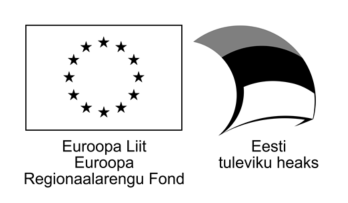

.. BIOGEOMON 2022 Workshop documentation master file, created by
   sphinx-quickstart on Fri Jun 24 19:14:08 2022.
   You can adapt this file completely to your liking, but it should at least
   contain the root `toctree` directive.

Welcome to the BIOGEOMON 2022 Workshop!
=======================================

`BIOGEOMON Pre-conference
Workshop <https://biogeomon2022.ut.ee/pre-conference-workshop>`__

.. image:: _static/biogeomon_logo_0.jpg
   :height: 100

There are wide range of global or regional level climate data available
in a gridded format. Under the changing climate, we need to quantify the
variability of temperature and rainfall patterns to understand the
impact of climate change on ecosystems. In this workshop, we teach the
participants how to handle NetCDF datasets, apply the Mann-Kendall (MK)
test and calculate Sen’s slope (SS) values on a gridded climate dataset.

We will be using Python packages from the
`Pangeo <https://pangeo.io/about.html>`__ community, including
`Jupyter <http://jupyter.org/>`__ notebooks and the
`Xarray <https://xarray.pydata.org/en/latest/>`__ toolkit for working
with labeled multi-dimensional arrays of data. In addition, we will
demonstrate a few basic steps how to improve reproducibility and
pro-actively apply FAIR principles when sharing and archiving data and
code online for publishing via `GitHub <https://github.com/>`__ and
`Zenodo <https://zenodo.org/>`__.

.. toctree::
   :maxdepth: 1
   :caption: Part 1 - Introduction and Installation:

   L0_install/overview
   L0_install/Installing_Miniconda_GIS
   L0_install/alt_install_miniconda
   L0_install/test_installation

.. toctree::
   :maxdepth: 1
   :caption: Part 2 - The Workshop:

   L1_data/workshop

.. toctree::
   :maxdepth: 1
   :caption: Part 3 - FAIR Github and Zenodo:

   L2_fair/overview

License
-------

Creative Commons Attribution-ShareAlike 4.0
`CC-BY-SA-4.0 <https://creativecommons.org/licenses/by-sa/4.0/>`__

`Landscape Geoinformatics (UT) <https://landscape-geoinformatics.ut.ee/home-0>`__

.. raw:: html

    Alexander Kmoch 
     
    Holger Virro 
     
    Bruno Montibeller 
     
    Evelyn Uuemaa 
     

Spatio-temporal trend analysis of spatial climate data (temperature and
rainfall) using Python (2021) Alexander Kmoch, Bruno Montibeller, Holger
Virro, Evelyn Uuemaa, |DOI|

.. |DOI| image:: https://zenodo.org/badge/DOI/10.5281/zenodo.5876348.svg
   :target: https://doi.org/10.5281/zenodo.5876348

Acknowledgments
---------------

Tartu Ülikooli ASTRA projekt PER ASPERA,
Maateaduste ja ökoloogia doktorikool 2016-2020,
Projekti kood: 2014–2020.4.01.16–0027

ETAG Mobilitas Pluss / MOBERC34

Landscape Geoinformatics Lab, University of Tartu

.. figure:: _static/lgeo_logo_eng_transparent.png
   :height: 80

More Geospatial Python
----------------------

We are also teaching a course with open materials:

https://kodu.ut.ee/~kmoch/geopython2021/

Geospatial Analysis with Python: The course teaches you how to do different GIS-related tasks in the Python programming language. Each lesson is a tutorial with specific topic(s) where the aim is to learn how to solve common GIS-related problems and tasks using Python tools. In the lessons we use only publicly available data which can be used and downloaded by anyone anywhere. In this course, we assume that you know the basics of Python programming - but we will also repeat Python basics in order to refresh everyone’s memory.

.. figure:: _static/Geopython_UT_banner.jpg
  :height: 80

Indices and tables
==================

* :ref:`genindex`
* :ref:`modindex`
* :ref:`search`
